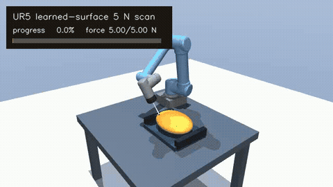

# UR5 + FT300 基于模型的学习曲面扫描与力控制

本项目使用 **MuJoCo + Pinocchio** 实现机械臂动力学控制、FT300 六维力传感处理、未知曲面学习、5 N 恒力扫描和鲁棒性验证。

当前推荐主线是 UR5 对未知曲面的两遍扫描：第一遍低力探索并学习表面，第二遍只使用学习结果完成约 1.54 m 的恒力扫描。



[下载 MP4 演示](docs/media/ur5_learned_surface_5n_scan.mp4)

## 项目结构

```text
ur5_ft300_model_based_control/
├── README.md
├── environment.yml
├── docs/
│   └── media/
│       ├── ur5_learned_surface_5n_scan.gif
│       └── ur5_learned_surface_5n_scan.mp4
├── examples/                         # 几何、运动学、动力学基础示例
└── experiments/
    ├── ur5_surface_scanning/         # 当前UR5曲面扫描主线
    │   ├── 89_* ... 107_*
    │   ├── ur5_ft300_inspection*
    │   └── results/robustness/
    └── archive/
        └── ur3_ft300_learning/       # 00–83、74/75及UR3历史模型
```

- [UR5 曲面扫描使用说明](experiments/ur5_surface_scanning/README.md)
- [UR3 早期学习实验归档说明](experiments/archive/ur3_ft300_learning/README.md)

## UR5 未知曲面主流程

```text
已知扫描区域的XY光栅布局
          ↓
97A：低力探索，采集实际TCP与FT300数据
          ↓
97B：拟合实际位置并估计表面法向
          ↓
97C：验证961个学习位姿全部可达、连续且无碰撞
          ↓
97D：仅使用97B学习曲面进行1.538 m、5 N扫描
          ↓
97E：工件偏移、倾斜和摩擦鲁棒性验证
```

97B 之后不使用解析真实曲面生成期望位置或法向。MuJoCo 中的解析椭球只是隐藏环境与碰撞几何。

## 97D 控制器

97D 不是简单关节轨迹回放，而是“学习模型前馈 + 在线力/力矩反馈”：

| 信号 | 控制作用 |
|---|---|
| 97B 学习位置 | 名义 TCP 位置 |
| 97B 学习法向/姿态 | 名义工具姿态 |
| FT300 法向力误差 | 法向压入位移导纳 |
| FT300 TCP 残余 X/Y 力矩 | Roll/Pitch 姿态导纳 |
| FT300 完整六维 wrench | 外力广义力补偿 |
| Pinocchio RNEA | 逆动力学前馈 |

法向导纳为：

\[
M_f\ddot d_n+D_f\dot d_n=F_d-F_n.
\]

姿态导纳为：

\[
I_r\ddot\theta+D_r\dot\theta+K_r\theta=-M_{TCP,xy}.
\]

FT300 力矩在进入姿态控制前先换算到探针 TCP：

\[
M_{TCP}=M_{FT300}-r_{FT300\rightarrow TCP}\times F.
\]

这可以排除探针力臂和扫描摩擦产生的搬运力矩。绕工具 Z 轴的力矩不用于调姿，以免摩擦驱动工具偏航。

## 已验证结果

### 97C 学习曲面全路径可达性

| 指标 | 结果 |
|---|---:|
| IK 成功 | 961 / 961 |
| 最大位置残差 | 0.0142 mm |
| 最大姿态残差 | 0.0041° |
| 最小雅可比奇异值 | 0.139974 |
| 最大条件数 | 13.41 |
| 关节限位违规 | 0 |
| 非预期碰撞 | 0 |

### 97D 5 N 完整扫描

| 指标 | 结果 |
|---|---:|
| 路径长度 | 1538.2 mm |
| 实际扫描时间 | 40.286 s |
| 法向力平均 / 最大误差 | 0.322 / 2.940 N |
| TCP 平均 / 最大误差 | 0.191 / 1.081 mm |
| 修正姿态最大跟踪误差 | 0.359° |
| 最大执行器力矩 | 39.867 Nm |
| 力矩饱和 | 0% |
| 非预期碰撞 | 0 |
| 结果 | PASS |

## 97E 鲁棒性验证

97E 沿用早期 75 系列的受控变量方法：控制器和 97B 学习轨迹保持不变，只改变控制器未知的工件或接触环境。

| 场景 | 结果 | 力平均/最大误差 | TCP最大误差 | 法向修正范围 |
|---|---|---:|---:|---:|
| 基准 | PASS | 0.322 / 2.940 N | 1.081 mm | -0.001～+0.767 mm |
| 工件 Z +1 mm | PASS | 0.315 / 2.656 N | 1.085 mm | -1.003～-0.119 mm |
| 工件 Z -1 mm | PASS | 0.315 / 2.890 N | 1.108 mm | +0.997～+1.656 mm |
| 工件 X +1 mm | PASS | 0.321 / 2.893 N | 1.120 mm | -0.158～+0.996 mm |
| 工件绕 Y +1° | PASS | 0.314 / 2.973 N | 1.073 mm | -1.419～+2.131 mm |
| 低摩擦 μ=0.15 | PASS | 0.322 / 2.940 N | 1.081 mm | -0.001～+0.767 mm |
| 高摩擦 μ=0.60 | FAIL | 0.527 / 7.076 N | 1.476 mm | -0.001～+0.805 mm |

高摩擦场景没有发生碰撞或力矩饱和，但换行瞬态超过当前力误差阈值。这是已记录的控制边界，不会被结果汇总隐藏。

完整结果位于：

```text
experiments/ur5_surface_scanning/results/robustness/
├── 97E_robustness_summary.csv
└── 97E_robustness_summary.npz
```

## 快速运行

```bash
cd ~/ur5_ft300_model_based_control/experiments/ur5_surface_scanning
conda activate ur5-control

# 学习曲面全路径可达性
env -u PYTHONPATH python 97C_check_learned_surface_reachability.py

# 5 N完整扫描
env -u PYTHONPATH python 97D_ur5_learned_surface_5n_scan.py

# 七个完整鲁棒性场景
env -u PYTHONPATH python 97E_ur5_learned_surface_robustness.py

# 从97D结果重新生成README媒体
MUJOCO_GL=egl env -u PYTHONPATH python 98_generate_ur5_scan_demo.py

# TSID模型一致性和MuJoCo姿态闭环
env -u PYTHONPATH python 100_validate_ur5_tsid_model.py
env -u PYTHONPATH python 101_ur5_tsid_mujoco_posture.py

# TSID笛卡尔多任务与HQP硬约束
env -u PYTHONPATH python 102_ur5_tsid_mujoco_se3_hierarchy.py
env -u PYTHONPATH python 103_ur5_tsid_hqp_safety_bounds.py

# TSID/HQP + FT300 5 N接触状态机
env -u PYTHONPATH python 104_ur5_tsid_ft300_5n_contact.py

# TSID/HQP学习曲面完整扫描和基准对比
env -u PYTHONPATH python 105_ur5_tsid_learned_surface_5n_scan.py
env -u PYTHONPATH python 106_compare_97d_vs_tsid_hqp.py

# TSID/HQP七场景鲁棒性验证
env -u PYTHONPATH python 107_ur5_tsid_learned_surface_robustness.py
```

关闭 MuJoCo Viewer 即可退出交互式扫描程序。97E 使用无界面仿真，并自动在完成后退出。

## 74/75 与 97A–97E 的关系

| UR3 早期流程 | UR5 当前流程 |
|---|---|
| 74A 低力扫描学习 | 97A 三维光栅低力探索 |
| 74B 学习路径 5 N 回放 | 97D 学习曲面 5 N 完整扫描 |
| 75 工件/摩擦/工具/噪声鲁棒性 | 97E 工件位姿与摩擦鲁棒性 |
| 约 30.7 mm 路径 | 约 1538.2 mm、961 位姿 |
| 平面内法向估计 | 完整三维曲面重建与 6D 姿态 |

旧实验保留在 `experiments/archive/ur3_ft300_learning/`，用于复现控制器的演进过程。

## 基础示例与 TSID

`examples/` 包含 SO(3)/SE(3)、正运动学、雅可比、wrench 映射、RNEA/CRBA/ABA 和计算力矩控制示例。

UR3 归档目录还保留：

- 关节 PD 与重力补偿
- 笛卡尔阻抗/导纳
- FT300 去零、重力补偿和滤波
- 曲面混合位置/力控制
- TSID/HQP 姿态、SE(3)、约束和接触力实验

当前 UR5 主线已新增 TSID/HQP 实机式仿真闭环：`100` 验证模型一致性，
`101` 使用 TSID 力矩直接驱动 MuJoCo，`102` 验证五维笛卡尔主任务与姿态
正则化，`103` 将关节及力矩边界作为 HQP 硬约束，`104` 完成 FT300
接触检测、5 N恒力保持和自动撤离，`105` 完成1.538 m学习曲面全路径
TSID/HQP扫描，`106` 自动生成与97D传统计算力矩控制器的定量对比报告。
`107`进一步完成工件偏移、倾斜及摩擦变化的7场景完整路径鲁棒性对比，
结果为6/7通过；高摩擦场景被如实保留为当前控制边界。

## 环境

当前完整 UR5 流程已在以下环境验证：

- Ubuntu 22.04
- Python 3.10
- MuJoCo 3.13.0
- Pinocchio 4.0.0
- TSID 1.10.0
- NumPy

可使用仓库中的 `environment.yml` 创建环境；如果终端已加载 ROS 2 的 Python 路径，运行独立 MuJoCo/Pinocchio 程序时使用 `env -u PYTHONPATH`。

## 注意事项

- 本仓库用于仿真与算法验证。
- 仿真增益不能直接用于真实 UR5。
- 上真实机械臂前必须重新验证关节力矩、速度、碰撞、急停、FT300 量程、控制周期和接触稳定性。
